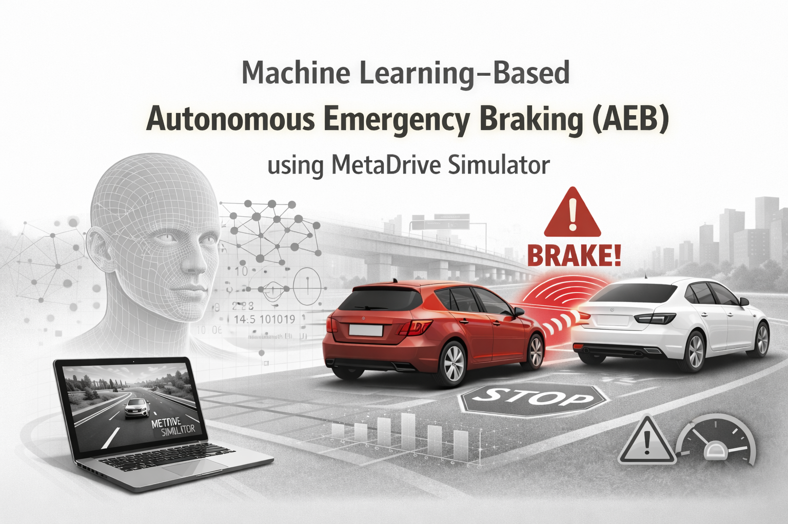
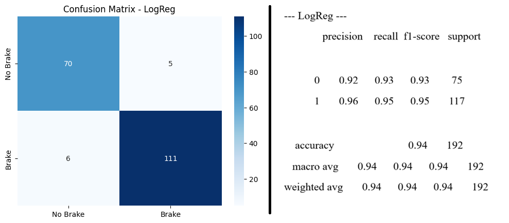
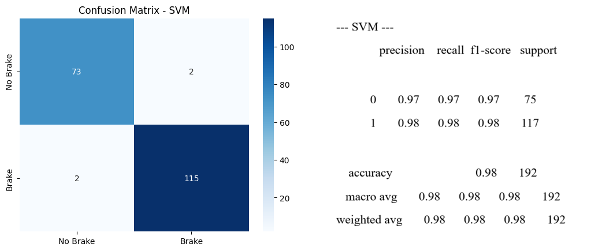
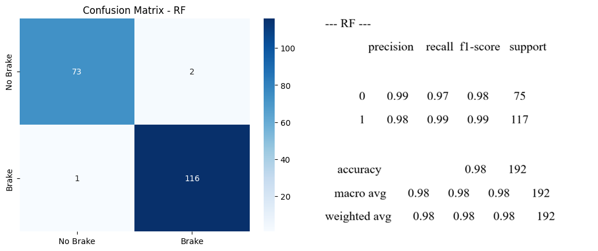
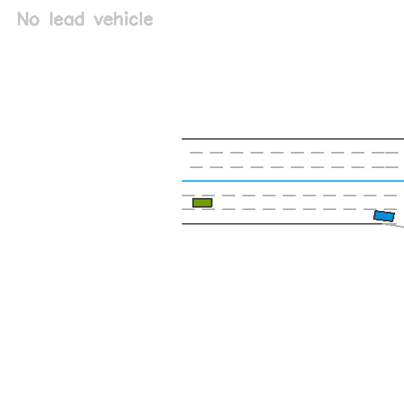

# 🚗 ML-Based Autonomous Emergency Braking (AEB) using Metadrive Simulator

This project implements a machine learning–based Autonomous Emergency Braking (AEB) decision module using tabular data. It predicts **whether to brake** and **how strongly to brake** based on ego vehicle speed, relative speed, and distance to the lead vehicle.



# **Project structure**

```text
ml-based-aeb/
├── data/
│   └── aeb_dataset.csv – Tabular dataset used for training the models.
├── models/  – Saved `.joblib` models (created after training).
│   ├── rf_brake_classifier.joblib
│   └── rf_brake_regressor.joblib
├── src/
│   ├── train_models.py - Script to train and evaluate: `brake_flag` & `brake_value`.
│   └── demo_inference.py - Loads the saved models and runs demo scenarios.
├── assets/
│   
├── ML_Based_AEB_Project_with_MetaDrive_Simulator.ipynb – Original notebook used for data. 
├── README.md
├── requirements.txt
└── .gitignore
```
---

## Installation

1. Clone the repository:

   ```bash
   git clone <your-repo-url>.git
   cd ml-based-aeb
   ```

2. Create and activate a virtual environment (example with venv):
```bash
python -m venv .venv
source .venv/bin/activate   # Linux/macOS
# .venv\Scripts\activate    # Windows PowerShell
```
3. Install dependencies:
```bash
pip install -r requirements.txt
```
---
## Data
Ensure data/aeb_dataset.csv exists and matches the expected schema, including at least:

1. ego_speed

2. rel_speed

3. distance

4. brake_flag

5. brake_value

> The dataset is assumed to come from AEB simulation runs (e.g., MetaDrive or similar), where each row corresponds to a timestep or scenario snapshot.
---
### How to run
1. Train models
From the project root, run:
```bash
python src/train_models.py
```
This will:
- Clean the data by replacing infinite values and dropping rows with missing key fields.

- Train a classification model (RandomForestClassifier) for brake_flag.

- Train a regression model (RandomForestRegressor) for brake_value.

- Print evaluation metrics:

  - Classification: accuracy, precision, recall, f1-score, confusion matrix.

  - Regression: mean squared error (MSE) and coefficient of determination (R²).

- Save the models to:

  - models/rf_brake_classifier.joblib

  - models/rf_brake_regressor.joblib

2. Run demo inference
After training, run:
  ```bash
  python src/demo_inference.py
  ```
This will:

- Loads both models from models/.

- Builds a sample scenario with ego_speed, rel_speed, and distance.

- Prints:

  - Classifier prediction: brake / no-brake + class probabilities.

  - Regressor prediction: continuous brake_value for the same scenario.

> You can edit the run_demo_scenario function in src/demo_inference.py to test different AEB situations (e.g., high speed and short distance vs safe following distance). 
---
## Results (current)
On the included dataset, the current models achieve approximately:

  - Classification (brake_flag)

    - Accuracy ≈ 0.98 on the held-out test set.

    - High precision/recall for both classes and a low number of misclassifications.

  - Regression (brake_value)

    - MSE ≈ 0.0005

    - R² ≈ 0.996, indicating that the model explains most of the variance in the target. 

	
  
    

(Exact numbers may vary slightly depending on random seeds and dataset updates.)
---
## Visuals:

 

---
## Future work
- [ ] Connect this AEB decision module with a driving simulator (e.g., MetaDrive or CARLA) for closed-loop testing.

- [ ] Add more features (e.g., relative acceleration, time-to-collision, lane information).

- [ ] Implement scenario-based evaluation and logging for different NCAP-style test cases.

- [ ] Package the model into a small service (REST API, gRPC, or ROS2 node) for integration into larger ADAS stacks. 